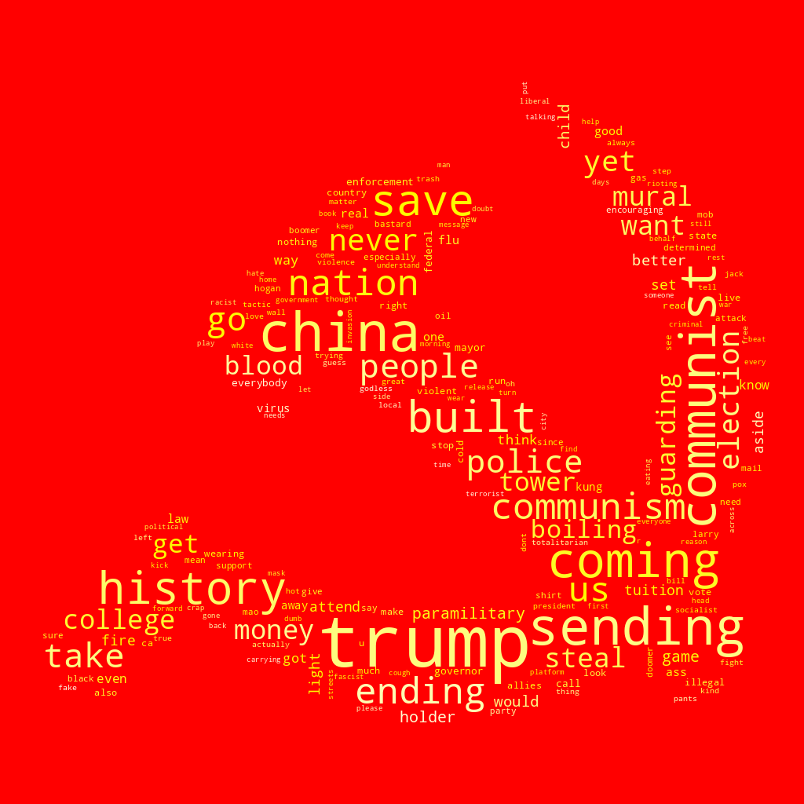

# Twitter Word Clouds

This is a simple python script that collects data from Twitter and makes a word
cloud. Install the required packages in a virtualenv, then call simply as:

```
$ python words.py communist.png commie result.png --time-limit 1800 --background red 
```

This would spend half an hour collecting tweets with the word "commie", then
create a word cloud using as a base the hammer and sickle from the following image:


```
Started collecting Tweeter data on: 2020-07-22 23:21:49.399617
0.43%
0.65%
0.77%
...
99.65%
99.94%
100.03%
Finished collecting Tweeter data on: 2020-07-22 23:51:49.941462
```

The final word cloud looks like this:


